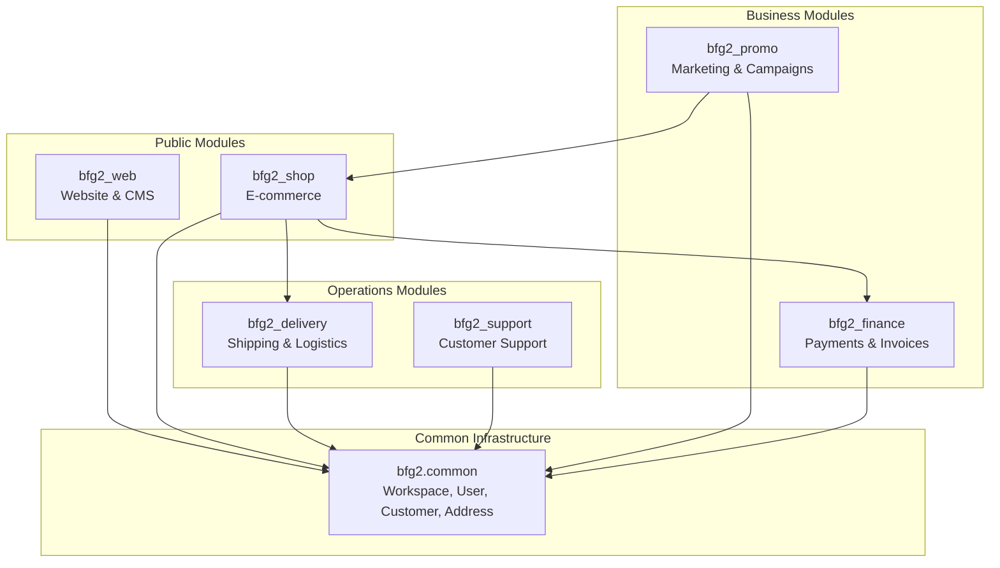

# BFG2 Library - Architecture Overview

## Project Vision

BFG2 is designed as an **independent, reusable Python/Django library** for building modern websites and e-commerce platforms. It provides a modular architecture where each module can be used independently or as part of a complete solution.

## Design Principles

### 1. **Independence**
- Can run as a standalone Django project
- Can be embedded into existing Django projects
- Minimal external dependencies
- Clean module boundaries

### 2. **Multi-tenancy**
- Built-in workspace isolation
- Shared database with workspace-based filtering
- Per-workspace configuration
- Secure data separation

### 3. **Multi-language Support**
- Django i18n framework integration
- Database-backed translations
- RTL language support
- Per-workspace default language

### 4. **Extensibility**
- Plugin architecture for custom modules
- Event hooks for business logic
- Customizable models via abstract bases
- Template override system

### 5. **API-First**
- RESTful API for all operations
- Django REST Framework integration
- API versioning support
- Comprehensive API documentation

## Module Architecture



## Module Dependencies

| Module | Depends On | Optional Dependencies |
|--------|-----------|----------------------|
| `bfg2_web` | `common` | - |
| `bfg2_shop` | `common`, `bfg2_finance` | `bfg2_delivery`, `bfg2_promo` |
| `bfg2_delivery` | `common` | `bfg2_shop` |
| `bfg2_promo` | `common` | `bfg2_shop` |
| `bfg2_finance` | `common` | - |
| `bfg2_support` | `common` | `bfg2_shop` |

## Technology Stack

### Core Framework
- **Django 5.x** - Web framework
- **Django REST Framework** - API development
- **Python 3.11+** - Programming language

### Database
- **MySQL/PostgreSQL** - Primary database
- Multi-workspace single database architecture
- Transaction isolation per workspace

### Multi-language
- **Django i18n** - Translation framework
- **django-modeltranslation** - Model field translation
- **django-parler** - Content translation (alternative)

### API & Integration
- **Django REST Framework** - RESTful APIs
- **drf-spectacular** - OpenAPI/Swagger documentation
- **django-cors-headers** - CORS support

### Payment Gateways
- **Stripe** - Credit card processing
- **WeChat Pay** - Chinese market
- **Alipay** - Chinese market
- Extensible gateway system

## Installation Methods

### Method 1: Standalone Project
```bash
# Clone or create new project
django-admin startproject myproject
cd myproject

# Install BFG2
pip install bfg2

# Add to INSTALLED_APPS
INSTALLED_APPS += [
    'bfg2.common',
    'bfg2_web',
    'bfg2_shop',
    'bfg2_delivery',
    'bfg2_promo',
    'bfg2_finance',
    'bfg2_support',
]
```

### Method 2: Embedded Module
```bash
# In existing Django project
pip install bfg2

# Add only needed modules
INSTALLED_APPS += [
    'bfg2.common',
    'bfg2_shop',  # Only e-commerce
    'bfg2_finance',  # Only finance
]
```

### Method 3: Development Mode
```bash
# Clone repository
git clone https://github.com/yourusername/bfg2.git
cd bfg2

# Install in development mode
pip install -e .
```

## Configuration

### Settings Example
```python
# settings.py

# BFG2 Configuration
BFG2_SETTINGS = {
    'MULTI_WORKSPACE': True,
    'DEFAULT_LANGUAGE': 'en',
    'SUPPORTED_LANGUAGES': ['en', 'zh-hans', 'zh-hant'],
    'CURRENCY_DEFAULT': 'NZD',
    'PAYMENT_GATEWAYS': {
        'stripe': {
            'enabled': True,
            'public_key': 'pk_test_...',
            'secret_key': 'sk_test_...',
        },
        'wechat': {
            'enabled': True,
            'app_id': 'wx...',
            'mch_id': '...',
        }
    },
    'EMAIL_NOTIFICATIONS': True,
    'SMS_NOTIFICATIONS': False,
}

# Multi-language
LANGUAGE_CODE = 'en'
LANGUAGES = [
    ('en', 'English'),
    ('zh-hans', '简体中文'),
    ('zh-hant', '繁體中文'),
]
```

## Database Schema Strategy

### Multi-workspace Implementation
All core models include a `workspace` ForeignKey:
```python
class Product(models.Model):
    workspace = models.ForeignKey('common.Workspace', on_delete=models.CASCADE)
    # ... other fields
```

### Model Managers
Custom managers enforce workspace filtering:
```python
class WorkspaceManager(models.Manager):
    def get_queryset(self):
        return super().get_queryset().filter(workspace=get_current_workspace())
```

## Migration from Freight App

The following models will be migrated from the existing `freight` app:

| Source Module | Model | Target Module | Notes |
|--------------|-------|---------------|-------|
| `freight/models/freight.py` | Warehouse, Manifest, Consignment, Package, FreightLog, FreightService | `bfg2_delivery` | Core delivery models |
| `freight/models/promotions.py` | CampaignGroup, Campaign, Coupon | `bfg2_promo` | Promotion system |
| `freight/models/finance.py` | Invoice, Payment, Transaction | `bfg2_finance` | Financial models |
| `freight/models/support.py` | SupportTicket, SupportTicketMessage | `bfg2_support` | Support system |

## Security Considerations

### Data Isolation
- Row-level security via workspace_id
- Middleware enforces workspace context
- No cross-workspace queries allowed

### Authentication
- Django authentication framework
- Token-based API authentication
- OAuth2 support for social login

### Permissions
- Role-based access control (RBAC)
- Per-workspace permissions
- Object-level permissions via django-guardian

## Performance Optimization

### Database
- Proper indexing on workspace_id
- Query optimization with select_related/prefetch_related
- Database connection pooling

### Caching
- Redis-based caching
- Per-workspace cache isolation
- Cache invalidation on updates

### API
- Pagination for list endpoints
- Field filtering to reduce payload
- ETag support for conditional requests

## Next Steps

1. Review this architecture document
2. Review individual module specifications in `docs/bfg2/`
3. Approve the implementation plan
4. Begin development of common infrastructure
